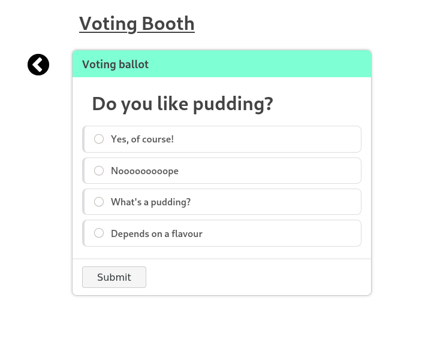

  

<h1 align="center">Decentralized voting app on Lisk</h1>

## Installation

Check out [Lisk SDK examples](https://github.com/LiskHQ/lisk-sdk-examples) and official [lisk.io documentation](https://lisk.io/documentation/lisk-sdk/index.html) for setup instructions.

## About

Dapp is pretty straightforward - every user can create as many polls and every user can vote (only once) for any existing poll. User is able to change his vote.

### Transactions

-   Create poll transaction
-   Create vote transaction

### Todo

-   Implement open poll transaction
-   Implement close poll transaction
-   Display stats of poll to owner
